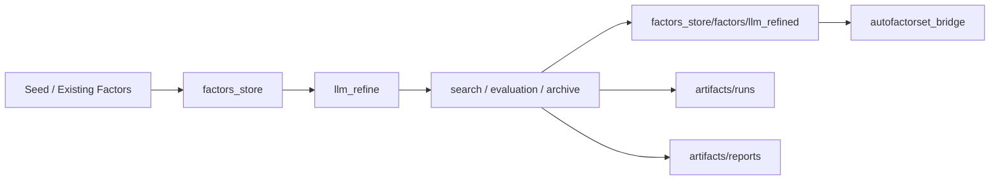
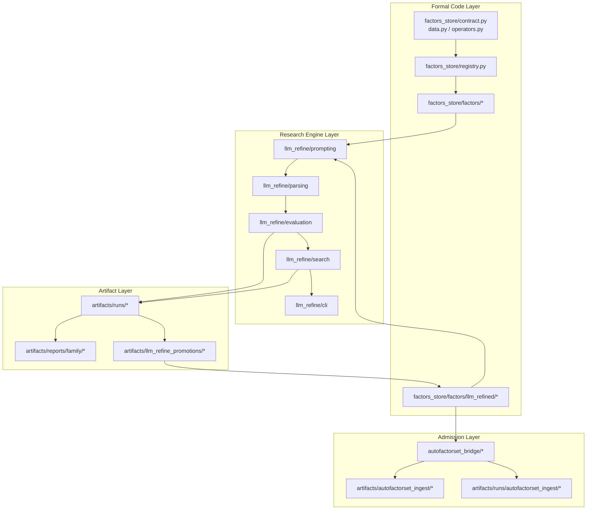
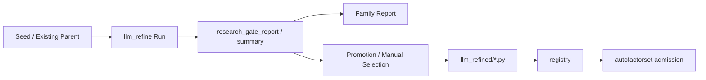

# AlphaRefinery
> An LLM-augmented family-level research pipeline for A-share daily alpha factors

[](https://www.python.org/)
[](#-project-status)
[](./factors_store/llm_refine/README.md)
[](./factors_store/llm_refine/README.md#target-conditioned-search)
[](./factors_store/llm_refine/README.md)

## ✨ Highlights

- 🧠 **Family-level research loop**, not one-shot formula generation
- 🧭 **Broad -> Anchor -> Focused** control over search progression
- 🌿 **Dual-parent branch preservation** with **Path Evaluation v2**
- 🎯 **Target-conditioned search** connected to evaluation, reports, promotion

## 📌 Start Here

- [Overview](#-overview)
- [Why AlphaRefinery](#-why-alpharefinery)
- [Core Capabilities](#-core-capabilities)
- [Project Status](#-project-status)
- [Quick Start](#-quick-start)
- [Common Workflows](#-common-workflows)
- [Roadmap](#-roadmap)

---

## ✨ Overview

**AlphaRefinery** is a unified research workspace for A-share daily alpha factors.

It is not a repository of disconnected factor formulas.  
It is a family-level research pipeline for discovering, refining, evaluating, and promoting alpha factors.

AlphaRefinery brings the full research loop into one workspace:

- Formal factor implementation, registration
- Family-level LLM-guided search, refinement
- Evaluation, archives, reports
- Formal factor promotion
- Downstream admission-oriented validation

In short, AlphaRefinery is built to support the full lifecycle of factor research, from idea exploration to promotion-ready integration.

---

## 🧠 Why AlphaRefinery

Traditional factor research workflows often stop at one of the following stages:

- Formula implementation
- Single-candidate evaluation
- Limited expression expansion
- Manual cross-experiment comparison

AlphaRefinery focuses on a different problem:

> **How to continuously operate a structured, repeatable, and scalable factor research loop at the family level.**

It is not just a generator of candidate expressions.  
It is a research operating pipeline for factor discovery, refinement, selection, and promotion.

---

## 🧭 Core Design Principles

### 1. Family-first research, not one-off formula generation

The system treats factor research as a structured search process over **factor families**, rather than a sequence of isolated formula proposals.

This is why AlphaRefinery includes mechanisms such as:

- Unified `SearchEngine`
- Family-level controller (`Broad -> Anchor -> Focused`)
- Dual-parent branch preservation
- Path Evaluation v2
- Target-conditioned search.

### 2. Controlled search progression, not flat candidate expansion

The system does not treat each round as a flat batch of disconnected proposals.

Instead, it drives search through a structured family-level progression:

- Unified `SearchEngine`
- Broad exploration for search-space coverage
- Anchor graduation for parent selection
- Focused continuation for local deepening

This gives AlphaRefinery a more explicit search policy than simple multi-sample generation.

### 3. Branch preservation, not winner-take-all collapse

Promising families do not always evolve along a single best-child line.

AlphaRefinery is built to preserve branch diversity long enough for the search process to learn from it:

- Dual-parent branch preservation
- Path Evaluation v2
- Comparative continuation across rounds
- Parent selection beyond immediate top1 scores

This helps the system avoid premature collapse into a single local motif.

### 4. Target-conditioned search, not raw-alpha-only scoring

The framework is already moving beyond a single-objective “raw alpha only” mindset.

Current search objectives include:

- `raw_alpha`
- `deployability`
- `complementarity`

The same search loop can therefore optimize toward different downstream preferences rather than a single universal score.

It also connects naturally to:

- Promotion workflows
- Funnel evaluation
- Family reports
- Admission-oriented downstream validation

`robustness` has already been reserved at the interface level, which keeps the search objective layer extensible as research preferences evolve.

---

## 🏗 What the Repository Contains

AlphaRefinery currently serves as the unified root workspace for three major lines of work:

- **Formal factors, registry**
- **Family-level research loops via `llm_refine`**
- **Artifacts, reports, admission-oriented evaluation**

In practice:

- Formal code in `factors_store/`
- Formal factors in `factors_store/factors/`
- Research artifacts, reports in `artifacts/`

## 🗺 System Map



## 🏛 Architecture



---

## ⚙️ Core Capabilities

### Formal factor library and registry

AlphaRefinery maintains a structured factor registry and a formal implementation layer for production-grade factors, including:

* Data contracts
* Operator abstractions
* Registry-based factor management
* Formal factor implementations
* Direct computation through the registry interface.

### LLM-guided family-level refinement

The `llm_refine` subsystem is currently the most active research engine in the project.

It supports:

* Family loop (`Broad -> Anchor Graduation -> Focused`)
* Round1 bootstrap through preferred/oriented seeds, donor retrieval, role-constrained generation
* Focused multi-model rounds
* Multi-round schedulers
* Dual-parent branch preservation
* Path Evaluation
* Target-conditioned search
* Archive, reporting, promotion, funnel evaluation workflows.

This means the project does not treat LLMs as simple expression generators.
Instead, LLM proposals are embedded into a broader research loop.

### Round1 bootstrap strategy

For new or weak families, round1 is no longer treated as a blind single-seed mutation step.

It can combine:

* Preferred/oriented seed selection
* Donor motif retrieval from adjacent families
* Role-constrained candidate slots
* Light rerank before full evaluation.

### Research artifact management

A major design principle of AlphaRefinery is the separation between:

* **Research artifacts**
* **Formal promoted factors**

This allows the system to retain full research history while keeping the official factor layer clean and maintainable.

### Admission-oriented downstream evaluation

Promoted factors can be further evaluated through the `autofactorset_bridge` workflow, adding another layer of admission screening before broader inclusion or deployment-oriented consideration.

---

## 📦 Project Status

AlphaRefinery has evolved beyond a lightweight prototype.
It is already capable of supporting a complete factor research loop in a usable working environment.

### Registered factors

Current registered factor counts:

* `alpha101`: `101`
* `alpha158`: `158`
* `alpha191`: `191`
* `alpha360`: `360`
* `gp_mined`: `12`
* `seed_baseline`: `4`
* `qp_kline`: `9`
* `qp_momentum`: `16`
* `qp_volatility`: `20`
* `qp_behavior`: `8`
* `qp_salience`: `9`
* `qp_chip`: `8`
* `llm_refined`: `123`

**Total: `1019` registered factors**

### Development note

This project is still under active development.

The current architecture is already functional, but several modules are still being improved, expanded, or restructured. Future iterations may include:

* Additional search objectives
* Richer evaluation criteria
* More robust archive, promotion tooling
* Improved reporting, workflow automation
* Further extensions to intraday evaluation, downstream admission logic.

So while the system is already usable, it should still be viewed as an evolving research platform rather than a finalized product.

---

## 🧩 Key Subsystems

| Subsystem                           | Role                                                  | Typical Path                   |
| ----------------------------------- | ----------------------------------------------------- | ------------------------------ |
| Formal factors and computation      | Registry, data contract, formal factor implementation | `factors_store/`               |
| LLM-driven factor research          | Family loop, round1 bootstrap, search, dual-parent    | `factors_store/llm_refine/`    |
| Research evaluation                 | Seed-to-winner uplift, funnel, profile split          | `artifacts/reports/evaluator/` |
| Artifacts and downstream evaluation | Runs, reports, promotion, autofactorset ingest        | `artifacts/`                   |

### 1. Formal code layer

`factors_store/` contains:

* Data contracts
* Registry definitions
* Daily evaluation utilities
* Formal factor implementations
* `llm_refine` subsystem
* `autofactorset_bridge`.

### 2. Formal promoted factor layer

`factors_store/factors/llm_refined/` stores factors that are already:

* Formally registrable
* Directly callable through `registry.compute(...)`
* Ready to enter downstream admission workflows.

### 3. Research artifact layer

`artifacts/` stores:

* `llm_refine` runs
* Family reports
* Promotion candidates
* `autofactorset` manifests, admission runs.

The canonical run root is:

* `artifacts/runs/`

---

## 🔄 Research Artifact Lifecycle

A typical family-level result usually follows the path below:



Typical repository destinations:

| Stage                       | Typical Output Path                       |
| --------------------------- | ----------------------------------------- |
| Intermediate run artifacts  | `artifacts/runs/...`                      |
| Family-level summaries      | `artifacts/reports/family/...`            |
| Promotion / curated patches | `artifacts/llm_refine_promotions/...`     |
| Formal promoted factors     | `factors_store/factors/llm_refined/...`   |
| Admission evaluation        | `artifacts/runs/autofactorset_ingest/...` |

---

## 🧾 Data Contract

### Core daily fields

* `open`
* `high`
* `low`
* `close`
* `volume`
* `vwap`

### Extended commonly used fields

* `pre_close`
* `amount`
* `turnover`
* `pct_chg`
* `is_st`
* `trade_status`

### Derived fields

* `returns`

### Optional context fields

* `benchmark_open`
* `benchmark_close`
* `market_return`
* `cap`
* `size`
* `float_market_cap`
* `smb`
* `hml`

---

## ⏱ Intraday Evaluation

The project already supports part of the evaluation workflow for intraday factors:

* `5min -> readout -> daily backtest`

Current support includes:

* Single-factor intraday evaluation
* Batch evaluation
* Standard `5min` YAML configurations
* Selected custom higher-order operators.

> Note: this part of the workflow is still being refined and may continue to evolve together with the broader evaluation stack.

---

## 🚀 Quick Start

```bash
cd /root/workspace/zxy_workspace/AlphaRefinery
```

### 0. Load the `llm_refine` provider environment

Before running any `llm_refine` workflow, first execute:

```bash
source ./llm_refine_provider_env.sh
```

This is recommended because the `run_refine_*` CLI tools contain fallback defaults.
If the environment is not loaded explicitly, they may fall back to built-in provider or base URL settings, which is usually not the intended configuration.

Most shared run / provider / path defaults are centralized in:

* `factors_store/llm_refine/config.py`

### 1. Compute a formal factor directly

```python
from factors_store import build_data, create_default_registry

data = build_data(
    panel_path="/root/dmd/BaoStock/panel.parquet",
    benchmark_path="/root/dmd/BaoStock/Index/sh.000001.csv",
    start="2018-01-01",
    apply_filters=True,
    stock_only=True,
    exclude_st=True,
    exclude_suspended=True,
    min_listed_days=60,
)

registry = create_default_registry()
factor = registry.compute("alpha101.alpha013", data)
print(factor.dropna().head())
```

### 2. Start a new family with the default family loop

```bash
source ./llm_refine_provider_env.sh

PYTHONPATH=/root/workspace/zxy_workspace/AlphaRefinery \
python -m factors_store.llm_refine.cli.run_refine_family_loop \
  --family qp_low_price_accumulation_pressure \
  --models gpt-5.4,deepseek-v3.1,qwen3.5-plus \
  --broad-policy-preset exploratory \
  --focused-policy-preset balanced \
  --target-profile raw_alpha \
  --n-candidates 8 \
  --broad-max-rounds 2 \
  --focused-max-rounds 2 \
  --auto-apply-promotion
```

---

## 🛠 Common Workflows

Unless stated otherwise, all `llm_refine` workflows are typically run after:

```bash
cd /root/workspace/zxy_workspace/AlphaRefinery
source ./llm_refine_provider_env.sh
```

### 1. First run for a new family

Suitable for:

* Starting a new family under the current default workflow
* Broad pass, anchor graduation, focused continuation.

Recommended entry:

* `run_refine_family_loop`

```bash
PYTHONPATH=/root/workspace/zxy_workspace/AlphaRefinery \
python -m factors_store.llm_refine.cli.run_refine_family_loop \
  --family qp_low_price_accumulation_pressure \
  --models gpt-5.4,deepseek-v3.1,qwen3.5-plus \
  --broad-policy-preset exploratory \
  --focused-policy-preset balanced \
  --target-profile raw_alpha
```

Typical outputs to inspect:

* `artifacts/runs/llm_refine_family_loop/...`
* `family_loop_summary.md`
* Broad, focused `summary.json`

If you only need a smoke test for prompt / parser / evaluator wiring, use `run_refine_loop`.

### 2. Focused round around an existing parent

Suitable for:

* Continuing refinement around a known strong parent
* Multi-model proposals around the same line of development.

Recommended entry:

* `run_refine_multi_model`

```bash
PYTHONPATH=/root/workspace/zxy_workspace/AlphaRefinery \
python -m factors_store.llm_refine.cli.run_refine_multi_model \
  --family weighted_upper_shadow_distribution \
  --models gpt-5.4,deepseek-v3.1,qwen3.5-plus \
  --current-parent-name llm_refined.upper_body_reject_amt_10 \
  --current-parent-expression "neg(ema(where(div(sub(high, rowmax(open, close)), add(pre_close, 1e-12)) > 0.01, mul(div(sub(high, rowmax(open, close)), add(pre_close, 1e-12)), amount), 0), 10))" \
  --policy-preset balanced \
  --target-profile complementarity \
  --n-candidates 6
```

What to focus on:

* Multi-model convergence toward similar structural motifs
* Agreement between `research_winner`, `best child`
* Emergence of a more suitable next-round parent.

### 3. Dual-track continuation with scheduler

Suitable for:

* Preserving two promising research branches
* Avoiding premature collapse into a single line
* Running 2–3 rounds of automatic comparative exploration.

Recommended entry:

* `run_refine_multi_model_scheduler`

```bash
PYTHONPATH=/root/workspace/zxy_workspace/AlphaRefinery \
python -m factors_store.llm_refine.cli.run_refine_multi_model_scheduler \
  --family weighted_upper_shadow_distribution \
  --models gpt-5.4,deepseek-v3.1,qwen3.5-plus \
  --policy-preset balanced \
  --target-profile complementarity \
  --enable-dual-parent-round \
  --bootstrap-parent-name llm_refined.upper_body_reject_amt_10 \
  --bootstrap-parent-expression "neg(ema(where(div(sub(high, rowmax(open, close)), add(pre_close, 1e-12)) > 0.01, mul(div(sub(high, rowmax(open, close)), add(pre_close, 1e-12)), amount), 0), 10))" \
  --bootstrap-parent-name llmgen.turnover_confirmed_shadow_15 \
  --bootstrap-parent-expression "neg(ema(where(gt(turnover, ts_mean(turnover, 20)), mul(div(sub(high, close), add(pre_close, 1e-12)), amount), 0), 15))" \
  --n-candidates 6 \
  --max-rounds 2
```

What to focus on:

* Preservation of `quality_parent`, `expandability_parent`
* Parent selection shifts under `branch_value_score`, `target_conditioned_score`
* Meaningful divergence in round 2 or round 3.

### 4. Evaluate framework effectiveness

Suitable for:

* Recent framework impact on `seed -> winner` uplift
* `raw_alpha` vs `complementarity`
* Stability of top3 / keep / winner outcomes.

Recommended entry:

* `run_research_funnel.py`

```bash
cd /root/workspace/zxy_workspace/AlphaRefinery

PYTHONPATH=/root/workspace/zxy_workspace/AlphaRefinery \
python -m factors_store.llm_refine.cli.run_research_funnel
```

Typical outputs to inspect:

* `artifacts/reports/evaluator/run_uplift_summary.csv`
* `artifacts/reports/evaluator/family_funnel_summary.csv`
* `artifacts/reports/evaluator/family_profile_funnel_summary.csv`

### 5. Promote research results into formal Python factors

Suitable for:

* Factors worth preserving from a research run
* Converting run artifacts into formal registry assets.

Typical process:

1. Inspect `artifacts/reports/family/...`
2. Select promising factors from `research_winner` or the shortlist
3. Write them into the appropriate family file under:

   * `factors_store/factors/llm_refined/..._family.py`
4. Update, if necessary:

   * `FACTOR_SPECS`
   * `__all__`
   * `factors_store/factors/llm_refined/__init__.py`
5. Run basic compilation checks

Example:

```bash
python -m py_compile \
  /root/workspace/zxy_workspace/AlphaRefinery/factors_store/factors/llm_refined/weighted_upper_shadow_distribution_family.py
```

After this step, a candidate factor is no longer just a research artifact — it becomes a formal, registrable factor.

### 6. Run `autofactorset` admission

Suitable for:

* Factors already registered in the formal library
* Downstream admission evaluation before broader use or deployment-oriented consideration.

Recommended entry:

* `evaluate_registry_manifest.py`

```bash
cd /root/workspace/zxy_workspace/AlphaRefinery

PYTHONPATH=/root/workspace/zxy_workspace/AlphaRefinery \
python -m factors_store.autofactorset_bridge.evaluate_registry_manifest \
  --manifest /root/workspace/zxy_workspace/AlphaRefinery/artifacts/autofactorset_ingest/manifests/example.yaml \
  --run-root /root/workspace/zxy_workspace/AlphaRefinery/artifacts/runs/autofactorset_ingest/manual_smoke \
  --label-horizon 1
```

To insert promoted factors into the library:

```bash
--insert-promoted
```

Typical downstream concerns:

* Promotion pass status
* Similarity, redundancy against the existing library
* Realistic deployment candidacy.

---

## 🗂 Repository Structure

```text
AlphaRefinery/
├── README.md
├── PROJECT_MAP.md
├── llm_refine_provider_env.sh
├── run_refine.sh
├── factors_store/
│   ├── factors/
│   ├── llm_refine/
│   └── autofactorset_bridge/
└── artifacts/
    ├── runs/
    ├── reports/
    ├── logs/
    ├── llm_refine_promotions/
    └── autofactorset_ingest/
```

For a more detailed project map, see:

* [PROJECT_MAP.md](./PROJECT_MAP.md)

---

## 📚 Recommended Reading Order

### If you want to understand the full repository first

1. [README.md](./README.md)
2. [PROJECT_MAP.md](./PROJECT_MAP.md)

### If you want to focus on `llm_refine`

1. [factors_store/llm_refine/README.md](./factors_store/llm_refine/README.md)
2. [factors_store/llm_refine/docs/modes.md](./factors_store/llm_refine/docs/modes.md)
3. [factors_store/llm_refine/docs/search_and_dual_parent.md](./factors_store/llm_refine/docs/search_and_dual_parent.md)

### If you want to inspect a family research result

Start with:

* [artifacts/reports/family/](./artifacts/reports/family)

Then trace back to the corresponding:

* `artifacts/runs/...`

---

## 🛣 Roadmap

The project is continuing to evolve. Near-term directions may include:

* More target-conditioned search objectives
* Stronger robustness-aware evaluation
* More automated promotion, reporting pipelines
* Cleaner integration between family research, admission workflows
* Expanded support for intraday, cross-frequency evaluation.

---

## 🪪 One-Sentence Summary

**AlphaRefinery is a unified research workspace for A-share alpha factors, integrating formal factor implementation, LLM-guided family refinement, research artifact management, and downstream admission evaluation into a single evolving pipeline.**
