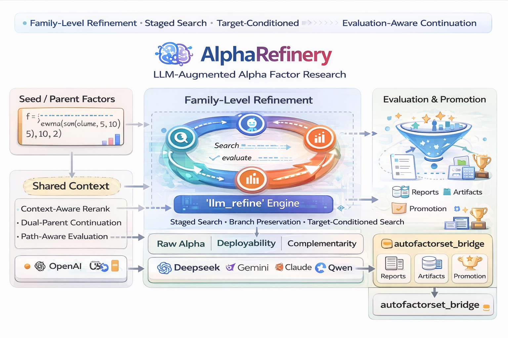
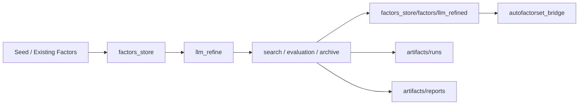
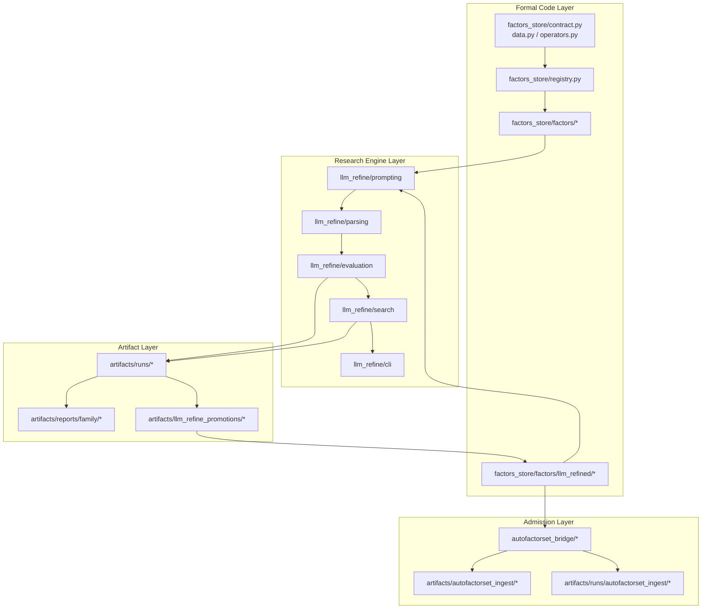
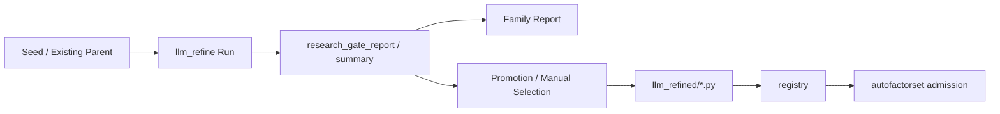

# AlphaRefinery
> 🧠 An LLM-augmented research platform for A-share daily alpha factors, built around family-level refinement, search, and promotion

[](https://www.python.org/)
[](#project-status)
[](./factors_store/llm_refine/README.md)
[](./factors_store/llm_refine/README.md)
[](./factors_store/llm_refine/README.md)

🚩 **Flagship subsystem:** [`llm_refine`](./factors_store/llm_refine/README.md) — a family-level LLM-guided factor refinement engine with staged search progression, branch preservation, target-conditioned search, and context-aware decision support.

<p align="center">
  
</p>

## ✨ Highlights

- 🧠 **Flagship engine: `llm_refine`**, built for family-level refinement rather than one-shot formula mutation
- 🧭 **Broad -> Anchor -> Focused** staged search progression
- 🌿 **Dual-parent branch preservation** with **Path Evaluation**
- 🎯 **Target-conditioned search** for `raw_alpha`, `deployability`, and `complementarity`
- 🧩 **Context-aware decision support** for rerank, anchor selection, and next-step recommendation
- 🪄 **De-correlation-aware refinement** for lower-redundancy candidate generation
- 🏗 Surrounding infrastructure for **evaluation, reports, promotion, and optional downstream admission**

## 📌 Start Here

- [Overview](#overview)
- [Why AlphaRefinery](#why-alpharefinery)
- [Core Design Principles](#core-design-principles)
- [System Map](#system-map)
- [Core Capabilities](#core-capabilities)
- [Quick Start](#quick-start)
- [Common Workflows](#common-workflows)
- [Project Status](#project-status)
- [Roadmap](#roadmap)
- [Read the `llm_refine` subsystem README](./factors_store/llm_refine/README.md)

---

## Overview

**AlphaRefinery** is a unified research platform for A-share daily alpha factors.

Its core differentiator is not a registry, a report folder, or a collection of factor formulas.  
Its flagship subsystem, [`llm_refine`](./factors_store/llm_refine/README.md), is designed for **family-level factor refinement** rather than one-shot expression generation.

`llm_refine` organizes factor search as a staged, context-aware research process with:

- family-level search progression,
- branch preservation,
- target-conditioned objectives,
- evaluation-aware continuation,
- and promotion-oriented refinement.

Around this engine, AlphaRefinery provides the surrounding infrastructure needed for repeatable research:

- formal factor implementation and registration,
- evaluation, archives, and reports,
- formal factor promotion,
- and an optional downstream admission adapter.

In short, AlphaRefinery combines a flagship LLM-driven refinement engine with the supporting infrastructure required for continuous factor research.

---

## Why AlphaRefinery

Traditional factor research workflows often stop at one of the following stages:

- implementing a formula,
- evaluating a single candidate,
- generating a few nearby expressions,
- or manually continuing from disconnected experiments.

AlphaRefinery focuses on a different problem:

> **How to continuously operate a structured, repeatable, and scalable factor research loop at the family level.**

This is why the project is not framed as a prompt wrapper or a factor generator.  
It is built as a research operating platform for:

- discovery,
- refinement,
- selection,
- promotion,
- and continued search.

---

## Core Design Principles

### 1. Family-first search, not isolated candidate generation

AlphaRefinery treats refinement as search over a **factor family**, not as disconnected batches of candidate expressions.

This makes it possible to carry forward:

- search state,
- parent choice,
- branch diversity,
- and accumulated research context.

### 2. Staged progression, not flat multi-sample prompting

The flagship refinement loop supports an explicit search progression:

- **Broad** for opening the search space,
- **Anchor** for selecting promising continuation points,
- **Focused** for local deepening and confirmation.

This gives the system a more deliberate search policy than plain candidate sampling.

### 3. Branch preservation, not premature top1 collapse

Promising families do not always evolve along a single best-child line.

AlphaRefinery therefore preserves branch diversity long enough for the search process to learn from it through:

- dual-parent continuation,
- path-aware evaluation,
- comparative branch development,
- and parent selection beyond immediate top1 scores.

### 4. Target-conditioned refinement, not raw-alpha-only optimization

The refinement loop is already structured to support different downstream preferences, including:

- `raw_alpha`
- `deployability`
- `complementarity`

This allows the same research engine to serve different goals, from stronger standalone alpha to better library complementarity and promotion quality.

---

## What the Repository Contains

AlphaRefinery serves as the unified workspace for three major layers of work:

- **formal factors and registry**
- **family-level research loops driven by `llm_refine`**
- **artifacts, reports, and optional downstream admission-oriented evaluation**

In practice:

- tracked config lives in `config/`
- formal code lives in `factors_store/`
- formal factors live in `factors_store/factors/`
- research artifacts and reports live in `artifacts/`

## System Map



## Architecture



---

## Core Capabilities

### 1. `llm_refine`: the flagship research engine

The `llm_refine` subsystem is the main methodological core of the project.

It currently supports:

* family loop (`Broad -> Anchor Graduation -> Focused`)
* round1 bootstrap through preferred/oriented seeds, donor retrieval, and role-constrained generation
* focused multi-model refinement rounds
* multi-round schedulers
* dual-parent branch preservation
* Path Evaluation
* target-conditioned search
* context-aware rerank and anchor selection
* archive, reporting, promotion, and funnel evaluation workflows

See:

* [factors_store/llm_refine/README.md](./factors_store/llm_refine/README.md)

### 2. Formal factor library and registry

AlphaRefinery maintains a structured factor registry and formal factor implementation layer, including:

* data contracts,
* operator abstractions,
* registry-based factor management,
* formal factor implementations,
* and direct computation through the registry interface.

### 3. Research artifact management

The project keeps research outputs separate from formal promoted factors.

This allows it to preserve:

* full run history,
* family reports,
* promotion candidates,
* and evaluation artifacts,

while keeping the formal factor layer cleaner and more maintainable.

### 4. Optional downstream admission adapter

Promoted factors can optionally flow through `autofactorset_bridge` for downstream library admission or company-specific promotion checks.

This layer is intentionally optional.
The main AlphaRefinery research workflow does **not** depend on it.

---

## Project Status

AlphaRefinery has evolved beyond a lightweight prototype.
It is already capable of supporting a complete family-level factor research loop in a usable working environment.

### Registered factors

Current registered factor counts:

* `alpha101`: `101`
* `alpha158`: `158`
* `alpha191`: `191`
* `alpha360`: `360`
* `gp_mined`: `12`
* `seed_baseline`: `4`
* `qp_kline`: `9`
* `qp_momentum`: `16`
* `qp_volatility`: `20`
* `qp_behavior`: `8`
* `qp_salience`: `9`
* `qp_chip`: `8`
* `llm_refined`: `123`

**Total: `1019` registered factors**

#### Public vs private factor assets

This public repository keeps only a subset of factor implementations for reproducibility, examples, and benchmarking.

- Publicly retained factors mainly include open benchmark families and a small number of illustrative refinement outputs.
- Local/private factor assets such as full `llm_refined` families, mined research factors, and strategy-sensitive promotion results may remain outside version control.

This keeps the repository useful as a research framework while avoiding unnecessary exposure of private alpha assets.

### Development note

This project is still under active development.

The current architecture is already functional, but several modules are still being improved, expanded, or restructured. Future iterations may include:

* additional search objectives,
* richer evaluation criteria,
* more robust archive and promotion tooling,
* improved reporting and workflow automation,
* and further extensions to intraday evaluation and downstream admission logic.

So while the system is already usable, it should still be viewed as an evolving research platform rather than a finalized product.

---

## Key Subsystems

| Subsystem                   | Role                                    |
| --------------------------- | --------------------------------------- |
| `factors_store/`            | formal factor computation and registry  |
| `factors_store/llm_refine/` | flagship family-level refinement engine |
| `artifacts/`                | runs, reports, promotion artifacts      |
| `autofactorset_bridge/`     | optional downstream admission adapter   |

For a more detailed structural walkthrough, see:

* [PROJECT_MAP.md](./PROJECT_MAP.md)

---

## Research Artifact Lifecycle

A typical family-level result usually follows the path below:



Typical repository destinations:

| Stage                       | Typical Output Path                       |
| --------------------------- | ----------------------------------------- |
| Intermediate run artifacts  | `artifacts/runs/...`                      |
| Family-level summaries      | `artifacts/reports/family/...`            |
| Promotion / curated patches | `artifacts/llm_refine_promotions/...`     |
| Formal promoted factors     | `factors_store/factors/llm_refined/...`   |
| Admission evaluation        | `artifacts/runs/autofactorset_ingest/...` |

---

## Data Interface

AlphaRefinery currently works on A-share daily panel data with standard OHLCV-style fields, benchmark context, and optional cross-sectional context features.

Representative fields include:

* `open`
* `high`
* `low`
* `close`
* `volume`
* `vwap`
* `returns`
* `market_return`

Detailed field-level definitions are best understood from implementation code and project mapping docs rather than the homepage README.

---

## Intraday Support

Partial intraday evaluation support is available for selected workflows:

* `5min -> readout -> daily backtest`

This remains an auxiliary capability and is still under active refinement.

---

## Quick Start

```bash
cd /root/workspace/zxy_workspace/AlphaRefinery
python -m pip install -r requirements.txt
```

If your data paths differ from the local defaults, set them before running:

```bash
export ALPHAREFINERY_PANEL_PATH=/path/to/panel.parquet
export ALPHAREFINERY_BENCHMARK_PATH=/path/to/benchmark.csv
export ALPHAREFINERY_INDUSTRY_CSV_PATH=/path/to/stock_industry.csv
```

If your BaoStock raw `daily.csv` files are updated separately, rebuild the aggregated panel before running experiments:

```bash
./update_panel_from_baostock.sh
```

### 0. Prepare the `llm_refine` provider environment

Before running any `llm_refine` workflow, execute:

```bash
cp -n ./llm_refine_provider_env.example.sh ./llm_refine_provider_env.sh
source ./llm_refine_provider_env.sh
```

The tracked template is `llm_refine_provider_env.example.sh`.
The copied `llm_refine_provider_env.sh` stays local and is ignored by git.

### 1. Compute a formal factor

```python
from factors_store import build_data, create_default_registry

data = build_data(
    panel_path="/root/dmd/BaoStock/panel.parquet",
    benchmark_path="/root/dmd/BaoStock/Index/sh.000001.csv",
    start="2018-01-01",
    apply_filters=True,
    stock_only=True,
    exclude_st=True,
    exclude_suspended=True,
    min_listed_days=60,
)

registry = create_default_registry()
factor = registry.compute("alpha101.alpha013", data)
print(factor.dropna().head())
```

### 2. Start a new family with the default family loop

```bash
source ./llm_refine_provider_env.sh

PYTHONPATH=/root/workspace/zxy_workspace/AlphaRefinery \
python -m factors_store.llm_refine.cli.run_refine_family_loop \
  --family qp_low_price_accumulation_pressure \
  --models gpt-5.4,deepseek-v3.1,qwen3.5-plus \
  --broad-policy-preset exploratory \
  --focused-policy-preset balanced \
  --target-profile raw_alpha \
  --n-candidates 8 \
  --broad-max-rounds 2 \
  --focused-max-rounds 2 \
  --auto-apply-promotion
```

---

## Common Workflows

### 1. Start a new family

Use `run_refine_family_loop` when you want the system to run:

* a broad pass,
* anchor graduation,
* and focused continuation

under the current default family controller.

```bash
PYTHONPATH=/root/workspace/zxy_workspace/AlphaRefinery \
python -m factors_store.llm_refine.cli.run_refine_family_loop \
  --family qp_low_price_accumulation_pressure \
  --models gpt-5.4,deepseek-v3.1,qwen3.5-plus \
  --broad-policy-preset exploratory \
  --focused-policy-preset balanced \
  --target-profile raw_alpha
```

### 2. Refine around an existing parent

Use `run_refine_multi_model` when you already have a strong parent and want to continue the main line with multi-model proposals.

```bash
PYTHONPATH=/root/workspace/zxy_workspace/AlphaRefinery \
python -m factors_store.llm_refine.cli.run_refine_multi_model \
  --family weighted_upper_shadow_distribution \
  --models gpt-5.4,deepseek-v3.1,qwen3.5-plus \
  --current-parent-name llm_refined.upper_body_reject_amt_10 \
  --current-parent-expression "neg(ema(where(div(sub(high, rowmax(open, close)), add(pre_close, 1e-12)) > 0.01, mul(div(sub(high, rowmax(open, close)), add(pre_close, 1e-12)), amount), 0), 10))" \
  --policy-preset balanced \
  --target-profile complementarity \
  --n-candidates 6
```

### 3. Evaluate framework effectiveness

Use `run_research_funnel.py` when you want to inspect whether recent framework changes improved:

* `seed -> winner` uplift,
* family funnel stability,
* or profile-specific outcomes.

```bash
cd /root/workspace/zxy_workspace/AlphaRefinery

PYTHONPATH=/root/workspace/zxy_workspace/AlphaRefinery \
python -m factors_store.llm_refine.cli.run_research_funnel
```

For more detailed execution patterns, read:

* [factors_store/llm_refine/README.md](./factors_store/llm_refine/README.md)

---

## Repository Structure

```text
AlphaRefinery/
├── README.md
├── PROJECT_MAP.md
├── requirements.txt
├── llm_refine_provider_env.example.sh
├── run_refine.sh
├── config/
│   ├── factor_manifests/
│   └── refinement_seed_pool.yaml
├── factors_store/
│   ├── _vendor/
│   │   └── gpqlib_runtime/
│   ├── factors/
│   ├── llm_refine/
│   └── autofactorset_bridge/
└── artifacts/
    ├── runs/
    ├── reports/
    ├── logs/
    ├── llm_refine_promotions/
    └── autofactorset_ingest/
```

---

## Recommended Reading Order

### If you want the big picture first

1. [README.md](./README.md)
2. [PROJECT_MAP.md](./PROJECT_MAP.md)

### If you want the flagship subsystem first

1. [factors_store/llm_refine/README.md](./factors_store/llm_refine/README.md)
2. [factors_store/llm_refine/docs/modes.md](./factors_store/llm_refine/docs/modes.md)
3. [factors_store/llm_refine/docs/search_and_dual_parent.md](./factors_store/llm_refine/docs/search_and_dual_parent.md)

### If you want to inspect research outputs

Start with:

* [artifacts/reports/family/](./artifacts/reports/family)

Then trace back to:

* `artifacts/runs/...`

---

## Roadmap

Near-term directions may include:

* more target-conditioned search objectives,
* stronger robustness-aware evaluation,
* more automated promotion and reporting pipelines,
* cleaner integration between family research and optional admission workflows,
* and broader support for intraday and cross-frequency evaluation.

---

## One-Sentence Summary

> **AlphaRefinery is an LLM-augmented research platform for A-share alpha factors, centered on the `llm_refine` family-level refinement engine and supported by formal factor infrastructure, research artifact management, and optional downstream admission workflows.**
