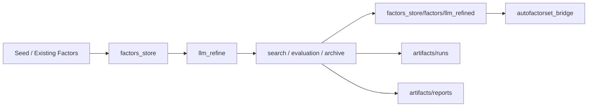
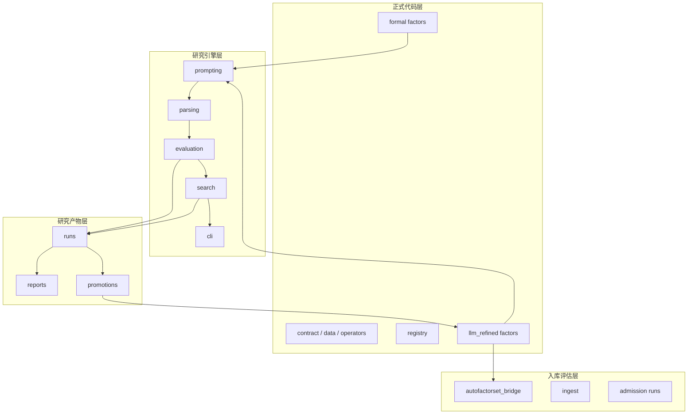

# AlphaRefinery
> 面向 A 股日频 Alpha 因子研究的 LLM 增强型发现、优化、评估与沉淀框架

[](https://www.python.org/)
[](#项目状态)
[](./factors_store/llm_refine/README.md)

## 项目简介

**AlphaRefinery** 是一个面向 A 股日频 Alpha 因子研究的统一工作台。  
它并不只关注“生成一个新因子表达式”，而是试图把因子研究组织成一条完整、可迭代、可沉淀的研究生产线。

该框架围绕以下几个核心环节构建：

- 正式因子实现与注册
- 基于 LLM 的 family 级因子搜索与优化
- 评估、筛选、归档与报告生成
- 优质研究结果向正式因子层的 promotion
- admission / downstream library 前的进一步验证

一句话来说，AlphaRefinery 关注的是：

> **如何把因子研究从离散实验，推进为可持续运转的结构化闭环。**

---

## 核心特点

### 1. 不是单次表达式生成，而是 family 级研究闭环

项目将因子研究视为围绕某一类经济逻辑持续展开的搜索问题，而不是零散地产出几个候选表达式。

当前框架已支持：

- family-first search
- dual-parent branch 保留
- Path Evaluation
- target-conditioned search

### 2. LLM 只是入口，工程闭环才是核心

LLM 在这里主要负责提出候选，但真正构成研究能力的是后续工程层：

- parser / repair
- evaluation / redundancy gate
- archive / promotion
- family summary / report

也就是说，重点不只是“生成”，而是“生成之后如何筛、如何留、如何继续演进”。

### 3. 研究产物与正式因子分层管理

项目明确区分：

- `artifacts/`：研究运行痕迹、中间结果、报告与 promotion 产物
- `factors_store/factors/`：正式沉淀、可注册、可复用的因子实现

这种分层既保留研究过程，又保持正式代码层的整洁性。

### 4. 搜索目标可扩展，而非只盯住 raw alpha

当前搜索目标不再局限于“哪条因子最强”，而开始支持更丰富的目标条件，例如：

- `raw_alpha`
- `deployability`
- `complementarity`

并预留了 `robustness` 等扩展接口，以适应不同研究偏好和下游组合目标。

---

## 系统结构



## 架构分层



---

## 项目状态

当前 registry 中已接入的因子包括：

* `alpha101`
* `alpha158`
* `alpha191`
* `alpha360`
* `gp_mined`
* `seed_baseline`
* `qp_kline`
* `qp_momentum`
* `qp_volatility`
* `qp_behavior`
* `qp_salience`
* `qp_chip`
* `llm_refined`

**总计：1019 个已注册因子**

目前，AlphaRefinery 已经可以支持从种子因子出发，到 family 级搜索、研究产物归档、正式 promotion、再到 admission 评估的一整条研究链路。

同时，本项目仍在持续迭代中，后续会继续完善：

* 更丰富的搜索目标
* 更稳健的评估标准
* 更自动化的 reporting / promotion 机制
* 更完整的 intraday 与 cross-frequency 支持

---

## 仓库结构

```text
AlphaRefinery/
├── README.md
├── PROJECT_MAP.md
├── llm_refine_provider_env.sh
├── factors_store/
│   ├── factors/
│   ├── llm_refine/
│   └── autofactorset_bridge/
└── artifacts/
    ├── runs/
    ├── reports/
    ├── llm_refine_promotions/
    └── autofactorset_ingest/
```

---

## 快速开始

### 1. 进入项目目录

```bash
cd /root/workspace/zxy_workspace/AlphaRefinery
```

### 2. 加载 `llm_refine` provider 环境

```bash
source ./llm_refine_provider_env.sh
```

### 3. 直接计算一个正式因子

```python
from factors_store import build_data, create_default_registry

data = build_data(
    panel_path="/root/dmd/BaoStock/panel.parquet",
    benchmark_path="/root/dmd/BaoStock/Index/sh.000001.csv",
    start="2018-01-01",
    apply_filters=True,
    stock_only=True,
    exclude_st=True,
    exclude_suspended=True,
    min_listed_days=60,
)

registry = create_default_registry()
factor = registry.compute("alpha101.alpha013", data)
print(factor.dropna().head())
```

### 4. 启动一条 `llm_refine` family round

```bash
PYTHONPATH=/root/workspace/zxy_workspace/AlphaRefinery \
python -m factors_store.llm_refine.cli.run_refine_multi_model \
  --family weighted_upper_shadow_distribution \
  --models gpt-5.4,deepseek-v3.1,qwen3.5-plus \
  --policy-preset balanced \
  --target-profile complementarity \
  --n-candidates 6
```

---

## 推荐阅读顺序

如果你想快速理解这个仓库，建议按以下顺序阅读：

1. `README.md`
2. `PROJECT_MAP.md`
3. `factors_store/llm_refine/README.md`

如果你想直接看某条 family 的研究结果，可以优先查看：

* `artifacts/reports/family/`
* `artifacts/runs/`

---

## Roadmap

接下来项目会继续沿以下方向推进：

* 更丰富的 target-conditioned search
* 更稳健的 robustness-aware evaluation
* 更自动化的 promotion 与 reporting
* family research 与 admission workflow 的进一步打通
* 更完整的分钟级与跨频评估能力

---

## 一句话总结

**AlphaRefinery 是一个面向 A 股 Alpha 因子研究的统一框架，将正式因子实现、LLM 驱动的 family 级优化、研究产物管理与下游 admission 评估整合为一条持续演进的研究生产线。**


