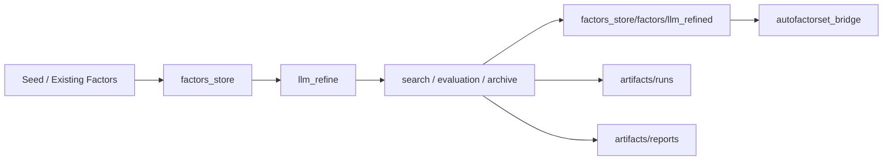
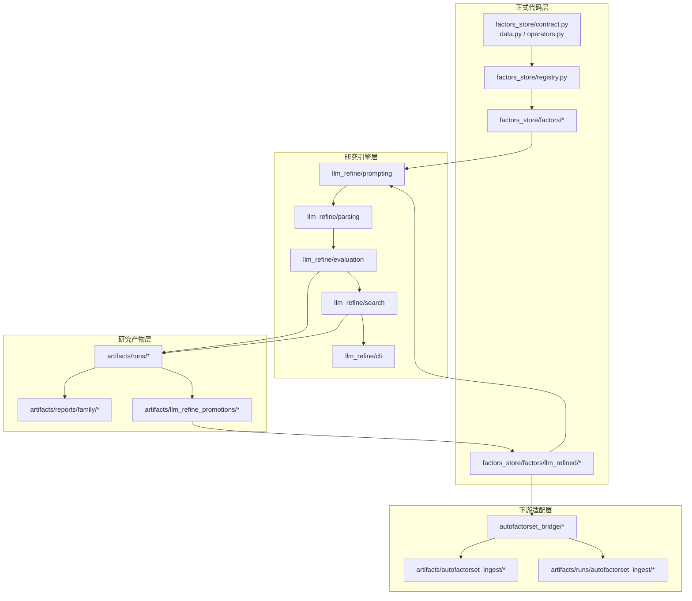
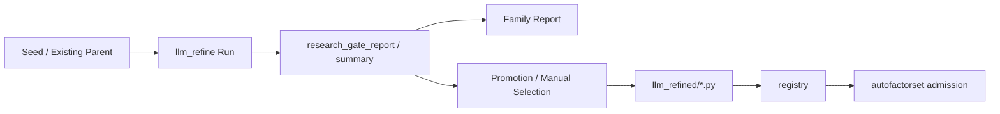

# AlphaRefinery
> 面向 A 股日频 Alpha 因子研究的 LLM 增强型研究平台，核心围绕 family-level refinement、search 与 promotion 展开

[](https://www.python.org/)
[](#项目状态)
[](./factors_store/llm_refine/README.md)
[](./factors_store/llm_refine/README.md)
[](./factors_store/llm_refine/README.md)

**🚩 旗舰子系统：** [`llm_refine`](./factors_store/llm_refine/README.md) —— 一个面向 family 级因子精炼的 LLM 驱动研究引擎，支持阶段化搜索推进、分支保留、目标条件化搜索，以及上下文感知决策。

## ✨ 项目亮点

- 🧠 **核心引擎是 `llm_refine`**，重点不是一次性公式生成，而是 family-level refinement
- 🧭 **Broad -> Anchor -> Focused** 的阶段化搜索推进
- 🌿 **双父分支保留** 与 **Path Evaluation**
- 🎯 面向 `raw_alpha`、`deployability`、`complementarity` 的**目标条件化搜索**
- 🧩 用于 rerank、anchor selection、next-step recommendation 的**上下文感知决策**
- 🪄 面向低冗余候选生成的 **de-correlation-aware refinement**
- 🏗 配套提供 **evaluation、reports、promotion，以及可选的下游 admission 支持**

## 📌 从这里开始

- [项目概览](#项目概览)
- [为什么是 AlphaRefinery](#为什么是-alpharefinery)
- [核心设计原则](#核心设计原则)
- [系统示意图](#系统示意图)
- [核心能力](#核心能力)
- [快速开始](#快速开始)
- [常见工作流](#常见工作流)
- [项目状态](#项目状态)
- [Roadmap](#roadmap)
- [阅读 `llm_refine` 子系统说明](./factors_store/llm_refine/README.md)

---

## 项目概览

**AlphaRefinery** 是一个面向 A 股日频 Alpha 因子的统一研究平台。

它的核心差异点不是 registry、报告目录，或者一组静态因子公式。  
项目最核心的部分是其旗舰子系统 [`llm_refine`](./factors_store/llm_refine/README.md)，它关注的是 **family 级因子 refinement**，而不是一次性表达式生成。

`llm_refine` 将因子搜索组织成一个阶段化、上下文感知的研究过程，包括：

- family-level 的搜索推进
- 分支保留
- 目标条件化优化
- 基于评估结果的继续搜索
- 面向 promotion 的 refinement

围绕这个核心引擎，AlphaRefinery 还提供支撑持续研究所需的配套基础设施，包括：

- 正式因子实现与注册
- evaluation、archive 与 reports
- 正式因子 promotion
- 可选的下游 admission 适配层

一句话来说，AlphaRefinery 试图把一个旗舰级 LLM refinement engine，与持续因子研究所需的外围基础设施结合起来。

---

## AlphaRefinery 核心优势

传统因子研究流程通常停留在以下某一步：

- 写一个公式
- 评估一个候选
- 让模型扩展几个相近表达式
- 手工比较几次彼此割裂的实验

AlphaRefinery 关注的是另一个问题：

> **如何以 family 为单位，持续运行一个结构化、可重复、可扩展的因子研究循环。**

因此，这个项目不是一个 prompt wrapper，也不是一个简单的 factor generator。  
它更像一个面向以下任务的研究操作平台：

- discovery
- refinement
- selection
- promotion
- continued search

---

## 核心设计原则

### 1. 以 family 为单位搜索，而不是孤立的候选生成

AlphaRefinery 将 refinement 看作对 **factor family** 的搜索，而不是几批彼此独立的候选表达式。

这样就可以在轮次之间持续保留：

- search state
- parent choice
- branch diversity
- 累积下来的研究上下文

### 2. 阶段化推进，而不是扁平的多样本 prompting

旗舰 refinement loop 支持显式的阶段推进：

- **Broad**：打开搜索空间
- **Anchor**：选择值得继续的主线
- **Focused**：局部深入与确认

这使系统具备比普通 candidate sampling 更明确的搜索策略。

### 3. 保留分支，而不是过早坍缩到 top1

有潜力的 family 未必总沿着一条 best-child 路径演化。

因此 AlphaRefinery 会通过以下机制保留分支多样性：

- dual-parent continuation
- path-aware evaluation
- comparative branch development
- 不仅依赖即时 top1 的父节点选择

### 4. 目标条件化 refinement，而不是只追 raw alpha

当前 refinement loop 已经支持面向不同下游目标优化，包括：

- `raw_alpha`
- `deployability`
- `complementarity`

这意味着同一套研究引擎可以服务不同目标：  
既可以追求更强的独立 alpha，也可以服务于更好的因子库互补性或 promotion 质量。

---

## 仓库包含什么

AlphaRefinery 当前是以下三层工作的统一工作区：

- **正式因子与 registry**
- **由 `llm_refine` 驱动的 family-level research loop**
- **artifacts、reports，以及可选的下游 admission 评估**

具体来说：

- 跟踪的配置放在 `config/`
- 正式代码放在 `factors_store/`
- 正式因子放在 `factors_store/factors/`
- 研究产物和报告放在 `artifacts/`

## 系统示意图



## 架构分层



---

## 核心能力

### 1. `llm_refine`：旗舰研究引擎

`llm_refine` 是当前项目最核心的方法层。

它目前支持：

* family loop（`Broad -> Anchor Graduation -> Focused`）
* 基于 preferred/oriented seed、donor retrieval、role-constrained generation 的 round1 bootstrap
* focused multi-model refinement rounds
* multi-round schedulers
* dual-parent branch preservation
* Path Evaluation
* target-conditioned search
* context-aware rerank 与 anchor selection
* archive、reporting、promotion 与 funnel evaluation workflows

详见：

* [factors_store/llm_refine/README.md](./factors_store/llm_refine/README.md)

### 2. 正式因子库与 registry

AlphaRefinery 维护了一套结构化的因子 registry 和正式因子实现层，包括：

* data contracts
* operator abstractions
* 基于 registry 的因子管理
* 正式因子实现
* 通过 registry 直接计算因子

### 3. 研究产物管理

项目将研究输出与正式因子层分开管理。

这样既可以保留：

* 完整 run history
* family reports
* promotion candidates
* evaluation artifacts

同时又能保持正式因子层更整洁、可维护。

### 4. 可选的下游 admission adapter

promotion 后的因子可以选择走 `autofactorset_bridge`，用于下游因子库 admission 或公司内部 promotion 检查。

这一层是**可选的**，核心的 AlphaRefinery 研究工作流并不依赖它。

---

## 项目状态

AlphaRefinery 已经不再是轻量级原型。
它已经可以在一个可用的工作环境中，支持完整的 family-level 因子研究流程。

### 开发说明

本项目仍在持续开发中。

当前架构已经可用，但若干模块仍在持续改进、扩展或重构。后续可能包括：

* 更多 search objectives
* 更丰富的 evaluation 指标
* 更稳健的 archive 与 promotion 工具
* 更完善的 reporting 与 workflow automation
* 对 intraday evaluation 和下游 admission 逻辑的进一步扩展

因此，尽管系统已经可用，但更适合将其理解为一个**持续演化的研究平台**，而不是一个最终定型的产品。

---

## 关键子系统

| 子系统                         | 作用                                |
| --------------------------- | --------------------------------- |
| `factors_store/`            | 正式因子计算与 registry                  |
| `factors_store/llm_refine/` | 旗舰 family-level refinement engine |
| `artifacts/`                | runs、reports、promotion artifacts  |
| `autofactorset_bridge/`     | 可选的下游 admission adapter           |

更详细的结构说明见：

* [PROJECT_MAP.md](./PROJECT_MAP.md)

---

## 研究产物生命周期

一个典型的 family-level 结果通常沿着下面这条路径推进：



典型目录落点如下：

| 阶段                          | 典型输出路径                                    |
| --------------------------- | ----------------------------------------- |
| 运行中间产物                      | `artifacts/runs/...`                      |
| family 级总结                  | `artifacts/reports/family/...`            |
| promotion / curated patches | `artifacts/llm_refine_promotions/...`     |
| 正式 promotion 因子             | `factors_store/factors/llm_refined/...`   |
| admission 评估                | `artifacts/runs/autofactorset_ingest/...` |

---

## 数据接口

AlphaRefinery 当前面向 A 股日频面板数据，支持标准 OHLCV 类字段、benchmark 上下文，以及可选的截面上下文字段。

代表性字段包括：

* `open`
* `high`
* `low`
* `close`
* `volume`
* `vwap`
* `returns`
* `market_return`

更细的字段定义更适合在实现代码和项目地图中查看，而不是放在首页 README 里逐项展开。

---

## Intraday 支持

项目对部分工作流提供了分钟级评估支持：

* `5min -> readout -> daily backtest`

这一能力目前仍属于辅助能力，并在持续完善中。

---

## 快速开始

```bash
cd /root/workspace/zxy_workspace/AlphaRefinery
python -m pip install -r requirements.txt
```

如果你的数据路径不同于默认本地配置，请先设置：

```bash
export ALPHAREFINERY_PANEL_PATH=/path/to/panel.parquet
export ALPHAREFINERY_BENCHMARK_PATH=/path/to/benchmark.csv
export ALPHAREFINERY_INDUSTRY_CSV_PATH=/path/to/stock_industry.csv
```

### 0. 准备 `llm_refine` provider 环境

在运行任何 `llm_refine` workflow 之前，请先执行：

```bash
cp -n ./llm_refine_provider_env.example.sh ./llm_refine_provider_env.sh
source ./llm_refine_provider_env.sh
```

跟踪入库的是 `llm_refine_provider_env.example.sh`。
复制出来的 `llm_refine_provider_env.sh` 只保留在本地，并且被 git ignore。

### 1. 直接计算一个正式因子

```python
from factors_store import build_data, create_default_registry

data = build_data(
    panel_path="/root/dmd/BaoStock/panel.parquet",
    benchmark_path="/root/dmd/BaoStock/Index/sh.000001.csv",
    start="2018-01-01",
    apply_filters=True,
    stock_only=True,
    exclude_st=True,
    exclude_suspended=True,
    min_listed_days=60,
)

registry = create_default_registry()
factor = registry.compute("alpha101.alpha013", data)
print(factor.dropna().head())
```

### 2. 用默认 family loop 启动一个新 family

```bash
source ./llm_refine_provider_env.sh

PYTHONPATH=/root/workspace/zxy_workspace/AlphaRefinery \
python -m factors_store.llm_refine.cli.run_refine_family_loop \
  --family qp_low_price_accumulation_pressure \
  --models gpt-5.4,deepseek-v3.1,qwen3.5-plus \
  --broad-policy-preset exploratory \
  --focused-policy-preset balanced \
  --target-profile raw_alpha \
  --n-candidates 8 \
  --broad-max-rounds 2 \
  --focused-max-rounds 2 \
  --auto-apply-promotion
```

---

## 常见工作流

### 1. 启动一个新 family

当你希望系统在当前 family controller 下自动执行：

* broad pass
* anchor graduation
* focused continuation

可以使用 `run_refine_family_loop`：

```bash
PYTHONPATH=/root/workspace/zxy_workspace/AlphaRefinery \
python -m factors_store.llm_refine.cli.run_refine_family_loop \
  --family qp_low_price_accumulation_pressure \
  --models gpt-5.4,deepseek-v3.1,qwen3.5-plus \
  --broad-policy-preset exploratory \
  --focused-policy-preset balanced \
  --target-profile raw_alpha
```

### 2. 围绕已有 parent 做 refinement

当你已经有一个较强的 parent，并希望用多模型 proposals 延续主线时，可以使用 `run_refine_multi_model`：

```bash
PYTHONPATH=/root/workspace/zxy_workspace/AlphaRefinery \
python -m factors_store.llm_refine.cli.run_refine_multi_model \
  --family weighted_upper_shadow_distribution \
  --models gpt-5.4,deepseek-v3.1,qwen3.5-plus \
  --current-parent-name llm_refined.upper_body_reject_amt_10 \
  --current-parent-expression "neg(ema(where(div(sub(high, rowmax(open, close)), add(pre_close, 1e-12)) > 0.01, mul(div(sub(high, rowmax(open, close)), add(pre_close, 1e-12)), amount), 0), 10))" \
  --policy-preset balanced \
  --target-profile complementarity \
  --n-candidates 6
```

### 3. 评估框架效果

当你想检查近期框架改动是否改善了：

* `seed -> winner` uplift
* family funnel stability
* profile-specific outcomes

可以使用 `run_research_funnel.py`：

```bash
cd /root/workspace/zxy_workspace/AlphaRefinery

PYTHONPATH=/root/workspace/zxy_workspace/AlphaRefinery \
python -m factors_store.llm_refine.cli.run_research_funnel
```

更详细的执行模式请见：

* [factors_store/llm_refine/README.md](./factors_store/llm_refine/README.md)

---

## 仓库结构

```text
AlphaRefinery/
├── README.md
├── README_CN.md
├── PROJECT_MAP.md
├── requirements.txt
├── llm_refine_provider_env.example.sh
├── config/
│   ├── factor_manifests/
│   └── refinement_seed_pool.yaml
├── docs/
│   └── assets/
├── factors_store/
│   ├── _vendor/
│   ├── factors/
│   ├── llm_refine/
│   └── autofactorset_bridge/
└── artifacts/
```

---

## 推荐阅读顺序

### 如果你想先看全局

1. [README.md](./README.md)
2. [README_CN.md](./README_CN.md)
3. [PROJECT_MAP.md](./PROJECT_MAP.md)

### 如果你想先看旗舰子系统

1. [factors_store/llm_refine/README.md](./factors_store/llm_refine/README.md)
2. [factors_store/llm_refine/docs/modes.md](./factors_store/llm_refine/docs/modes.md)
3. [factors_store/llm_refine/docs/search_and_dual_parent.md](./factors_store/llm_refine/docs/search_and_dual_parent.md)

### 如果你想看研究输出

从这里开始：

* [artifacts/reports/family/](./artifacts/reports/family)

再回溯到：

* `artifacts/runs/...`

---

## Roadmap

近期可能继续推进的方向包括：

* 更多 target-conditioned search objectives
* 更强的 robustness-aware evaluation
* 更自动化的 promotion 与 reporting pipeline
* 更清晰的 family research 与可选 admission workflow 联动
* 更广泛的 intraday 与 cross-frequency support

---

## 一句话总结

**AlphaRefinery 是一个面向 A 股 Alpha 因子的 LLM 增强型研究平台，以 `llm_refine` 这一 family-level refinement engine 为核心，并由正式因子基础设施、研究产物管理以及可选的下游 admission workflow 共同支撑。**

