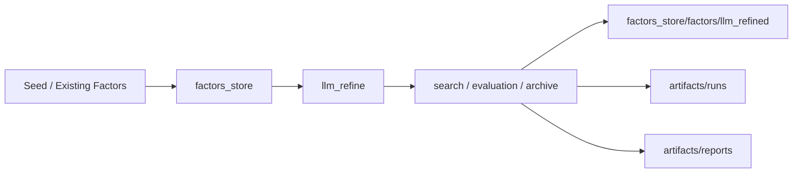
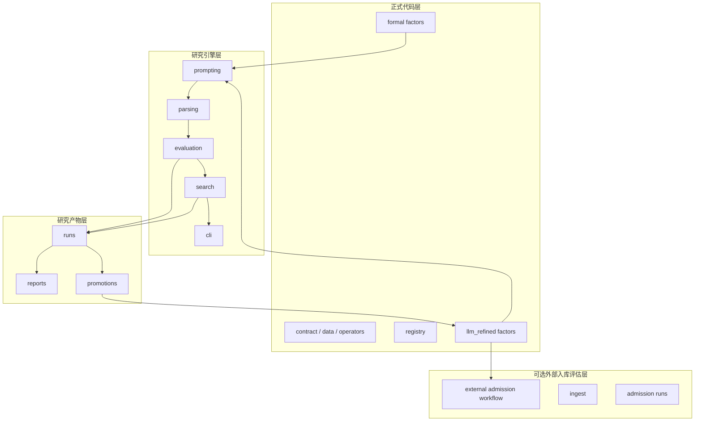

# AlphaRefinery
> 面向 A 股日频 Alpha 因子研究的 LLM 增强型发现、优化、评估与沉淀框架

[](https://www.python.org/)
[](#项目状态)
[](./factors_store/llm_refine/README.md)
[](./factors_store/llm_refine/README.md)
[](./factors_store/llm_refine/README.md)

## 项目简介

**AlphaRefinery** 是一个面向 A 股日频 Alpha 因子研究的统一工作台。

它不只是“生成一个新表达式”的仓库，而是一条完整的研究流水线，串起了：

- 正式因子实现与注册
- 基于 LLM 的 family 级搜索与优化
- 评估、归档、报告与 promotion
- 正式因子沉淀
- 可选的外部 admission / downstream library 前验证结果

一句话来说，AlphaRefinery 关注的是：

> **如何把因子研究从离散实验，推进为可持续运转的结构化 family research loop。**

在当前仓库结构下：

- 共享静态配置放在 `config/`
- 核心因子运行时已内置到 `factors_store/_vendor/gpqlib_runtime/`

在当前版本里，外部 admission 流程更适合作为可选的仓库外工作流：

- 如果你需要对接公司内部因子库或 admission 流程，可以在仓库外衔接
- 如果你只关注 family 级研究闭环，不带这部分也完全可以使用

---

## 核心特点

### 1. 不是单次表达式生成，而是 family 级研究闭环

项目把因子研究视为围绕某类经济逻辑持续展开的搜索过程，而不是零散地产出几个候选表达式。

当前框架已支持：

- 统一 `SearchEngine`
- family-level controller：`broad -> anchor -> focused`
- dual-parent branch 保留
- Path Evaluation v2
- target-conditioned search

### 2. LLM 只是入口，工程闭环才是核心

真正构成研究能力的是后续工程层：

- parser / repair
- round1 donor retrieval 与 bootstrap
- evaluation / redundancy gate
- archive / promotion
- funnel evaluation / family report

重点不只是“生成”，而是“生成之后如何筛、如何留、如何继续演进”。

### 2.5. 决策层开始统一，不再是分散 heuristic

最近一轮优化里，框架开始把原来分散在不同模块里的选择逻辑往一层统一的 decision layer 收：

- round-level rerank
- anchor selection
- family loop 的 next action recommendation
- de-correlation 场景下的排序偏好

也就是说，系统不再只是“各处各自聪明一点”，而是开始让同一套上下文去驱动：

- `stage_mode`
- `target_profile`
- `policy_preset`
- de-correlation targets
- neutralized evaluation diagnostics

这让 broad / focused / family loop 之间的口径更一致，也更便于后续继续扩展。

### 3. 研究产物与正式因子分层管理

项目明确区分：

- `artifacts/`：研究运行痕迹、中间结果、报告与 promotion 产物
- `factors_store/factors/`：正式沉淀、可注册、可复用的因子实现

这保证了研究过程完整可追溯，同时保持正式代码层整洁。

其中 `factors_store/factors/llm_refined/` 也可以作为本地或私有结果桶使用。公开仓库中可以只保留包骨架，而不包含具体 `*_family.py` 结果文件。

关于 `stage_mode / target_profile / policy_preset / mode` 这几层模式的区别与推荐搭配，见：

- [factors_store/llm_refine/README.md#模式分层说明](./factors_store/llm_refine/README.md#模式分层说明)

### 4. 搜索目标可扩展，而非只盯住 raw alpha

当前搜索目标已支持：

- `raw_alpha`
- `deployability`
- `complementarity`

并预留了 `robustness` 接口，以适应不同研究偏好和下游组合目标。

---

## 系统结构



## 架构分层



---

## 核心能力

### 正式因子库与 registry

项目维护了完整的正式因子实现层，包括：

- data contract
- operator 抽象
- registry 管理
- formal factor implementation
- 通过 `registry.compute(...)` 直接计算

### `llm_refine` family 级研究引擎

`llm_refine` 是当前最活跃的研究子系统，已支持：

- family loop：`broad -> anchor graduation -> focused`
- round1 bootstrap：preferred/oriented seed、donor retrieval、role-constrained generation
- focused multi-model round
- multi-round scheduler
- dual-parent branch preservation
- Path Evaluation
- target-conditioned search
- archive、promotion 与 funnel evaluation

这意味着项目并不把 LLM 当作“表达式生成器”，而是把提案嵌入到完整研究闭环里。

同时，`llm_refine` 也已经开始支持更明确的差异化搜索能力：

- de-correlation target-aware prompt guidance
- de-correlation diagnostics
- context-aware rerank hooks

### Round1 bootstrap 策略

对于新 family 或弱 seed，round1 不再是“围着单个 canonical seed 瞎改”。

它现在可以组合：

- preferred/oriented seed
- 邻近 family 的 donor motif retrieval
- role-constrained candidate slots
- full evaluation 前的 light rerank

### 研究评估

框架现在已经支持系统化评估：

- `seed -> winner` uplift
- family funnel
- family × target profile 分层
- top3 / keep / winner 稳定性

---

## 项目状态

当前 registry 中已接入：

* `alpha101`
* `alpha158`
* `alpha191`
* `alpha360`
* `gp_mined`
* `seed_baseline`
* `qp_kline`
* `qp_momentum`
* `qp_volatility`
* `qp_behavior`
* `qp_salience`
* `qp_chip`
* `llm_refined`

**总计：1019 个已注册因子**

目前，AlphaRefinery 已经可以支持从种子因子出发，到 family 级搜索、研究产物归档、正式 promotion，以及可选的外部 admission 结果衔接。

同时，本项目仍在持续迭代中，后续会继续完善：

* 更丰富的搜索目标
* 更稳健的评估标准
* 更自动化的 reporting / promotion
* 更完整的 family loop 闭环
* 更完整的 intraday 与 cross-frequency 支持

---

## 关键子系统

| 子系统 | 作用 | 典型路径 |
|---|---|---|
| 正式因子与计算 | registry、数据 contract、正式因子实现 | `factors_store/` |
| LLM 驱动研究 | family loop、round1 bootstrap、search、dual-parent | `factors_store/llm_refine/` |
| 研究评估 | uplift、funnel、profile split | `artifacts/reports/evaluator/` |
| 产物与可选外部评估 | runs、reports、promotion、autofactorset ingest | `artifacts/` |

---

## 快速开始

### 1. 进入项目目录

```bash
cd /root/workspace/zxy_workspace/AlphaRefinery
```

先安装一次 Python 依赖：

```bash
python -m pip install -r requirements.txt
```

如果你的数据路径不是当前机器的默认位置，先设置：

```bash
export ALPHAREFINERY_PANEL_PATH=/path/to/panel.parquet
export ALPHAREFINERY_BENCHMARK_PATH=/path/to/benchmark.csv
export ALPHAREFINERY_INDUSTRY_CSV_PATH=/path/to/stock_industry.csv
```

如果你的 BaoStock 原始 `daily.csv` 是单独按日更新的，建议在跑实验前先重建聚合 panel：

```bash
./update_panel_from_baostock.sh
```

这个脚本默认：

- 输入目录：`/root/dmd/BaoStock/daily`
- 输出 panel：`${ALPHAREFINERY_PANEL_PATH:-/root/dmd/BaoStock/panel.parquet}`

也可以用 `--input-root`、`--output`、`--start-date`、`--end-date` 这些参数覆盖。

### 2. 加载 `llm_refine` provider 环境

```bash
cp -n ./llm_refine_provider_env.example.sh ./llm_refine_provider_env.sh
source ./llm_refine_provider_env.sh
```

仓库里跟踪的是 `llm_refine_provider_env.example.sh`。
复制出来的 `llm_refine_provider_env.sh` 保持本地使用，不进 git。

如果不先加载，`run_refine_*` 入口会回退到 CLI 内置默认 provider，这通常不是日常研究想用的实际配置。

大部分共享 run / provider / path 默认值集中在：

- `factors_store/llm_refine/config.py`

### 3. 直接计算一个正式因子

```python
from factors_store import build_data, create_default_registry

data = build_data(
    panel_path="/root/dmd/BaoStock/panel.parquet",
    benchmark_path="/root/dmd/BaoStock/Index/sh.000001.csv",
    start="2018-01-01",
    apply_filters=True,
    stock_only=True,
    exclude_st=True,
    exclude_suspended=True,
    min_listed_days=60,
)

registry = create_default_registry()
factor = registry.compute("alpha101.alpha013", data)
print(factor.dropna().head())
```

### 4. 用默认 family loop 启动一个新 family

```bash
PYTHONPATH=/root/workspace/zxy_workspace/AlphaRefinery \
python -m factors_store.llm_refine.cli.run_refine_family_loop \
  --family qp_low_price_accumulation_pressure \
  --models gpt-5.4,deepseek-v3.1,qwen3.5-plus \
  --broad-policy-preset exploratory \
  --focused-policy-preset balanced \
  --target-profile raw_alpha \
  --n-candidates 8 \
  --broad-max-rounds 2 \
  --focused-max-rounds 2 \
  --auto-apply-promotion
```

---

## 常见工作流

默认前置：

```bash
cd /root/workspace/zxy_workspace/AlphaRefinery
source ./llm_refine_provider_env.sh
```

### 1. 新 family 的默认跑法

推荐入口：

- `run_refine_family_loop`

适合：

- 新 family 首跑
- broad 之后自动挑 1 条 anchor
- 再自动接 focused refine

典型输出：

- `artifacts/runs/llm_refine_family_loop/...`
- `family_loop_summary.md`
- broad / focused `summary.json`

### 2. 围绕已知强 parent 再挖一层

推荐入口：

- `run_refine_multi_model`

适合：

- 已经知道强 parent
- 想看多个模型围绕同一条主线继续细化

### 3. 让系统自动连续跑 2~3 轮

推荐入口：

- `run_refine_multi_model_scheduler`

适合：

- 已有比较清楚的主线
- 想保留双 branch
- 想看 round2 / round3 是否真正分化

### 4. 评估框架最近是否真的变强

推荐入口：

- `run_research_funnel`

```bash
PYTHONPATH=/root/workspace/zxy_workspace/AlphaRefinery \
python -m factors_store.llm_refine.cli.run_research_funnel
```

重点看：

- `run_uplift_summary.csv`
- `family_funnel_summary.csv`
- `family_profile_funnel_summary.csv`

---

## 仓库结构

```text
AlphaRefinery/
├── README.md
├── README_CN.md
├── PROJECT_MAP.md
├── requirements.txt
├── llm_refine_provider_env.example.sh
├── run_refine.sh
├── config/
│   ├── factor_manifests/
│   │   ├── alpha158.yaml
│   │   └── alpha360.yaml
│   └── refinement_seed_pool.yaml
├── factors_store/
│   ├── _vendor/
│   │   └── gpqlib_runtime/
│   ├── factors/
│   └── llm_refine/
└── artifacts/
    ├── runs/
    ├── reports/
    ├── logs/
    ├── llm_refine_promotions/
    └── autofactorset_ingest/
```

更详细的项目地图见：

- [PROJECT_MAP.md](./PROJECT_MAP.md)

---

## 推荐阅读顺序

如果想快速理解这个仓库，建议：

1. [README.md](./README.md)
2. [README_CN.md](./README_CN.md)
3. [PROJECT_MAP.md](./PROJECT_MAP.md)

如果想聚焦 `llm_refine`：

1. [factors_store/llm_refine/README.md](./factors_store/llm_refine/README.md)
2. [factors_store/llm_refine/docs/modes.md](./factors_store/llm_refine/docs/modes.md)
3. [factors_store/llm_refine/docs/search_and_dual_parent.md](./factors_store/llm_refine/docs/search_and_dual_parent.md)

---

## 一句话总结

**AlphaRefinery 是一个面向 A 股 Alpha 因子研究的统一框架，将正式因子实现、LLM 驱动的 family 级优化、研究评估，以及可选的外部 admission 工作流衔接整合为一条持续演进的研究生产线。**
